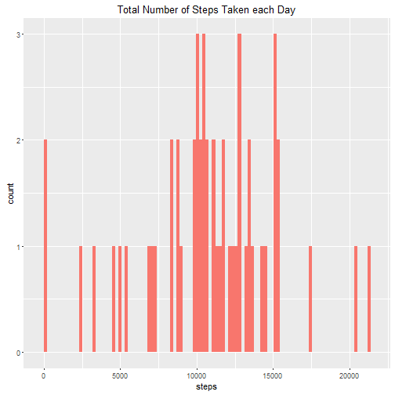
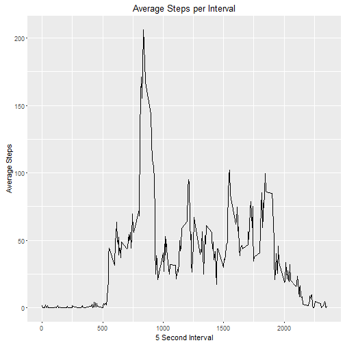
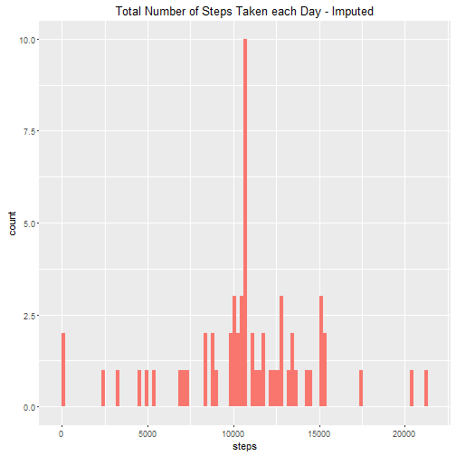
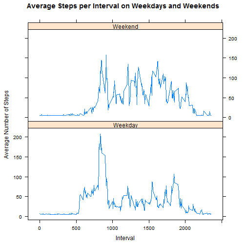

Reproducible Research Peer Assessment 1
============================================

## About the data
The variables included in this dataset are:

- **steps**: Number of steps taking in a 5-minute interval (missing values are coded as NA)
- **date**: The date on which the measurement was taken in YYYY-MM-DD format
- **interval**: Identifier for the 5-minute interval in which measurement was taken

##Loading the data

```r
  fitbit <- read.csv("C:/Users/Rachel/Desktop/Coursera/Reproducible Research/activity.csv")
```

##What is mean total number of steps taken per day?

1. Calculate the total number of steps taken per day

```r
  library(ggplot2)
```

```
## Warning: package 'ggplot2' was built under R version 3.2.3
```

```r
  steps_by_day <- aggregate(steps ~ date, fitbit, sum)
  
  qplot(steps, data=steps_by_day, geom="histogram", fill="red", bins=100) + 
    labs(title = "Total Number of Steps Taken each Day") +
    theme(legend.position='none')
```



2. Calculate mean and median number of steps taken each day


```r
  mean(steps_by_day$steps)
```

```
## [1] 10766.19
```

```r
  median(steps_by_day$steps)
```

```
## [1] 10765
```

The mean number of steps taken each day is 10766.19.  The median number of steps taken each day is 10765.

##What is the average daily activity pattern?

1. Time series plot of the 5-minute interval and the average number of steps taken, averaged across all days 

```r
  avg_steps <- aggregate(steps ~ interval, fitbit, mean)
    ggplot(data=avg_steps, aes(interval, steps)) + 
      geom_line() +
      xlab("5 Second Interval") +
      ylab("Average Steps") +
      ggtitle("Average Steps per Interval")
```



2. Identify the 5-minute interval that, on average, contains the maximum number of steps

```r
    avg_steps$interval[which(avg_steps$steps == max(avg_steps$steps))]
```

```
## [1] 835
```

Interval 835 contains the maximum number of steps

##Imputing missing values

1. Calculate and report the total number of missing values in the dataset

```r
    nrow(fitbit[is.na(fitbit$steps),])
```

```
## [1] 2304
```

There are 2304 missing values in the activity dataset.

2. Devise a strategy for filling in all of the missing values in the dataset.

To impute the missing values, I will use the average number of steps per interval

3. Create a new dataset that is equal to the original dataset but with the missing data filled in

```r
  ##Subset to include only cases that are not missing
    notmissing <- fitbit[!is.na(fitbit$steps),]
  ##Create the avg number of steps per interval with nonmissing data
    steps_interval_nm <- aggregate(steps ~ interval, notmissing, mean)
  ##Fill NA values with means
    imputed = transform(fitbit, steps = ifelse(is.na(steps), mean(steps_interval_nm$steps, na.rm=TRUE), steps))
```

##Make a histogram of the total number of steps taken each day and Calculate and report the mean and median total number of steps taken per day.


```r
  ##Calculate the total number of steps taken each day    
    steps_by_day_im <- aggregate(steps ~ date, imputed, sum)
  ##Plot histogram
  qplot(steps, data=steps_by_day_im, geom="histogram", fill="blue", bins=100) + 
    labs(title = "Total Number of Steps Taken each Day - Imputed") +
    theme(legend.position='none')
```



```r
  ##Calculate mean and median number of steps
    mean(steps_by_day_im$steps)
```

```
## [1] 10766.19
```

```r
    median(steps_by_day_im$steps)
```

```
## [1] 10766.19
```
Because I used the average number of steps per interval as my imputation method, the mean number of steps did not change before and after the imputation.  It is still 10766.19.  However, the median did increase slightly from 10765 to 10766.19. The histogram is much different after imputation, however.

##Are there differences in activity patterns between weekdays and weekends?
1. Create a new factor variable in the dataset with two levels - "weekday" and "weekend" indicating whether a given date is a weekday or weekend day.


```r
##Add day to imputed dataset
imputed$day <- weekdays(as.Date(imputed$date))
##Create new variable differentiating weekends from weekdays
imputed$daycat <- ifelse(imputed$day %in% c("Saturday", "Sunday"), "Weekend", "Weekday")
```

2. Make a panel plot containing a time series plot of the 5-minute interval and the average number of steps taken, averaged across all weekday days or weekend days.


```r
library(plyr)
```

```
## Warning: package 'plyr' was built under R version 3.2.3
```

```r
  ##Average steps by interval and weekday/weekend 
  avg_steps_im <- ddply(imputed, .(interval, daycat), summarize, Avg = mean(steps))
  ##Plot time series
library(lattice) 
    xyplot(Avg~interval|daycat, data=avg_steps_im, type="l",  layout = c(1,2),
       main="Average Steps per Interval on Weekdays and Weekends", 
       ylab="Average Number of Steps", xlab="Interval")
```



There are differences in steps between weekdays and weekends. In most cases, weekday and weekend behavior is opposite.  So there are taking more steps on weekends when there are fewer steps on weekdays, especially in the middle intervals (between 1000 and 2000).
